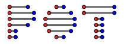

.. POT documentation master file, created by
   sphinx-quickstart on Mon Oct 24 11:10:10 2016.
   You can adapt this file completely to your liking, but it should at least
   contain the root `toctree` directive.

POT: Python Optimal Transport
=============================

Contents
--------

.. toctree::
   :maxdepth: 1

   self
   quickstart
   all
   auto_examples/index
   releases
   contributors
   contributing
   code_of_conduct

.. include:: ../../README.md
   :parser: myst_parser.sphinx_

Indices and tables
==================

* :ref:`genindex`
* :ref:`modindex`
* :ref:`search`
